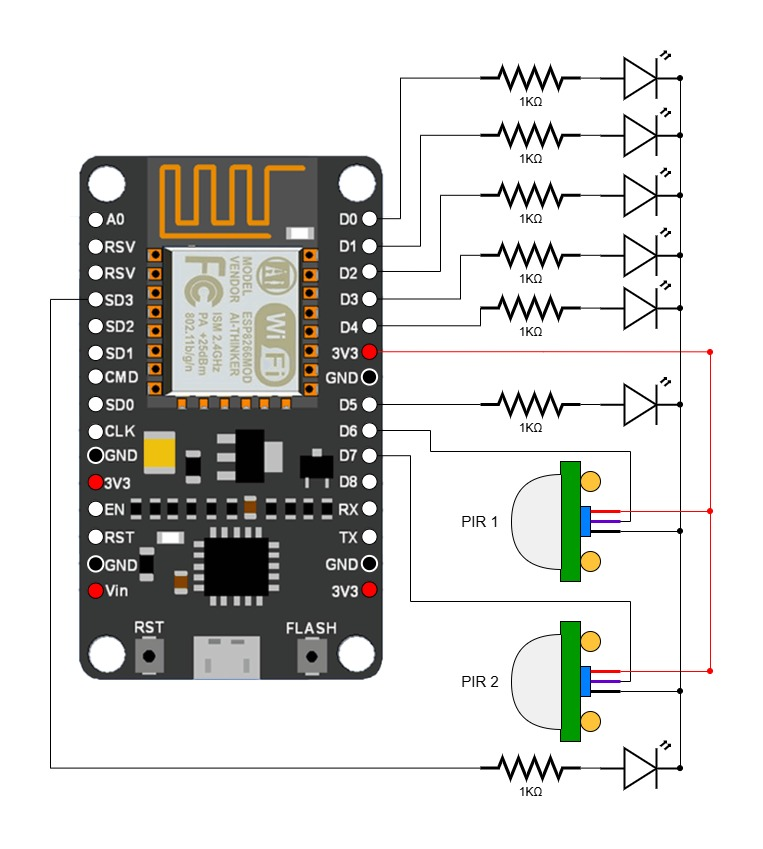

# Casa Connect - A Server-Based, Motion Triggered Home Automation System

## Overview

Casa Connect is a sophisticated home automation system designed to enhance convenience, safety, and energy efficiency through motion-triggered control of electrical appliances, particularly lighting. Utilizing the Node MCU microprocessor and PIR sensors, this system detects motion to automatically control lights and offers remote access via a hosted website.

## Features

- **Motion Detection**: Uses PIR sensors to detect movement and control lights automatically.
- **Remote Access**: Allows users to control lights from any device through a web interface hosted on a local server.
- **Energy Efficiency**: Reduces unnecessary energy consumption by ensuring lights are only on when needed.
- **Safety**: Enhances safety by automatically illuminating areas when motion is detected.

## Components

### Hardware

- **Node MCU (ESP-8266)**: Central microprocessor with built-in Wi-Fi used to host the home server.
- **PIR Sensors**: Detects infrared radiation to identify motion.
- **HW-131 Breadboard Power Supply**: Provides a stable power supply for the system.

### Software

- **Arduino IDE**: Used for coding and configuring the Node MCU.
- **HTML/CSS/JavaScript**: For creating the web interface.

## System Architecture

1. **Central Hub**: The Node MCU acts as the central hub, processing inputs from PIR sensors and user commands from the web interface.
2. **Wi-Fi Connectivity**: The Node MCU connects to the home network, enabling communication between the server and client devices.
3. **Motion Sensors**: PIR sensors installed in various locations detect motion and trigger corresponding actions.
4. **Power Supply**: HW-131 breadboard power supply ensures consistent power delivery to the system components.

## Installation and Setup

1. **Hardware Installation**:
   - Install PIR sensors at strategic locations in the house.
   - Connect the PIR sensors and lighting fixtures to the Node MCU as mentioned in the diagram. 
   - Ensure a stable power connection using the HW-131 power supply from the 5V rail to the .

2. **Server Setup**:
   - Establish a connection to the Node MCU from your computer.
   - Go to the file `server_code.ino` in the `server_code` directory.
   - Configure the Node MCU to host the server using its Wi-Fi module by changing the Wi-Fi SSID and password that it needs to connect to.
   - Push the file `server_code.ino` in the `server_code` directory onto the Node MCU/
   - Ensure the server can communicate with the PIR sensors and respond to user commands via the web interface.

3. **Integration**:
   - Integrate the Node MCU with the lighting fixtures.
   - Test the system to ensure accurate motion detection and reliable control of the lights.

## Usage

### Web Interface

- **Control Lights**: Toggle lights on/off from any device connected to the home network.
- **Master Switch**: Override motion detection to manually control lights via the web interface.

### Motion Detection

- **Automatic Control**: Lights turn on when motion is detected and turn off after a specified delay when no motion is detected.

## Applications

Casa Connect is versatile and can be used in:

- Personal homes
- Hotels
- Dormitories
- Small warehouses

## Future Enhancements

- **Advanced Sensors**: Use more sophisticated sensors for improved accuracy.
- **Calibration**: Fine-tune sensitivity and delay settings for optimal performance.
- **Security**: Enhance the security of the connection between the client and server.
- **Reliability**: Minimize connections between sensors and the main board to reduce potential points of failure.
- **Power Supply**: Implement a more reliable power system for uninterrupted operation.

## Authors

- Smaran Rangarajan Bharadwaj 
- Nayana C V
- G Mohith
- Shreyank Srinivasan
- Harisha
- Tulasi G Rayasa

School of Computer Science Engineering (SoCSE)  
RV University, Bengaluru – 560059